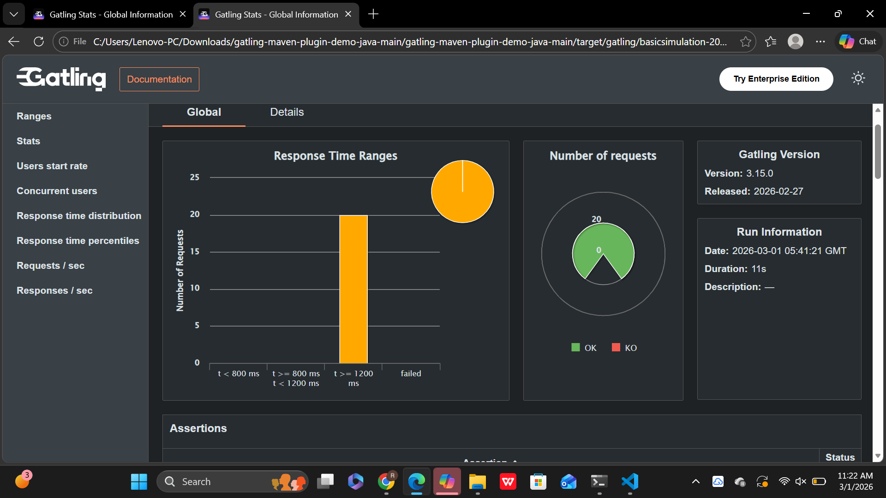
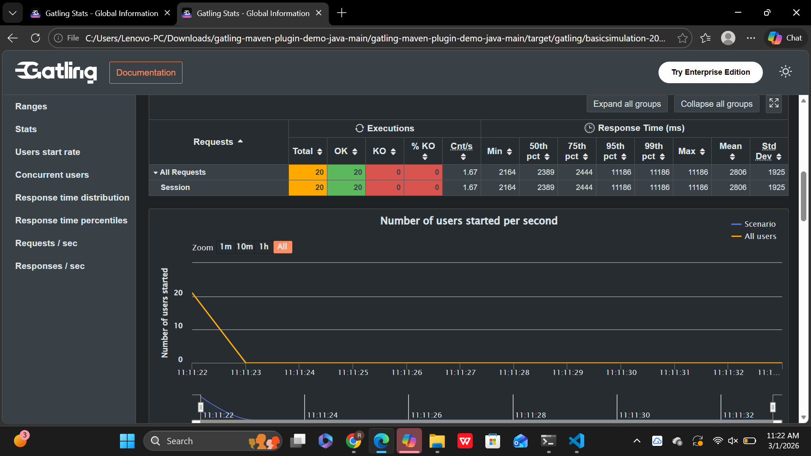
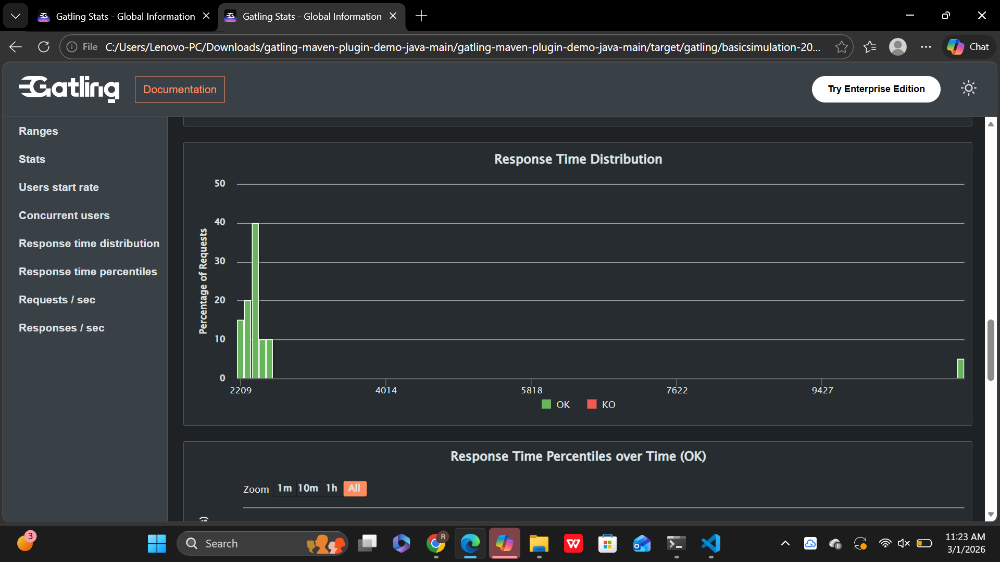
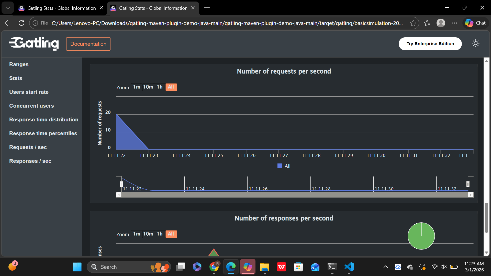
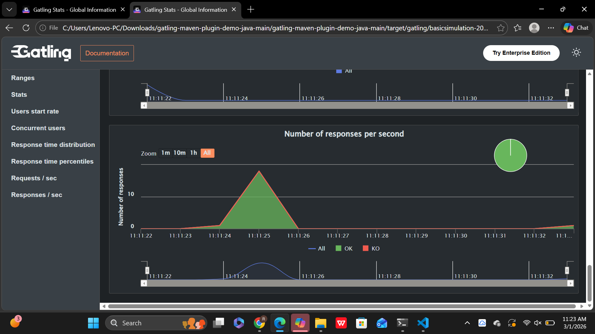

# Gatling_Load_Testing_Task4
# 🚀 Gatling Load Testing Report

## 🏢 Company
**CODETECH IT SOLUTIONS**

## 👩‍💻 Intern Details
- **Intern Name:** Garnepudi Renuka Rani  
- **Intern ID:** CTIS55575  
- **Domain:** Software Testing  
- **Duration:** 4 Weeks  
- **Mentor:** Neela Santhosh  

---

## 🎯 Project Objective
To perform advanced load testing on a web application using Gatling and analyze system performance under simulated heavy user load conditions.

---

## 🛠 Tools & Technologies Used
- Gatling (Scala-based load testing tool)  
- Java JDK  
- Scala  
- HTML Reports (Generated by Gatling)  

---

## 🌐 Target Application Details
- **Base URL:** `https://reqres.in`  
- **Endpoint Tested:** `/api/users?page=2`  
- **Request Type:** HTTP GET  

---

## 📊 Test Scenario
- Simulated **10 concurrent users**  
- **Ramp-up Time:** 30 seconds  
- Each virtual user sends an HTTP GET request to the target endpoint  
- Performance monitored during full load execution  

---

## 📝 Test Script Overview
The load test was developed using Gatling DSL in Scala.  
The script simulates multiple virtual users accessing the API simultaneously to evaluate system performance under heavy traffic conditions.

---

## 📈 Performance Metrics Analyzed
- Minimum Response Time  
- Maximum Response Time  
- Average Response Time  
- Requests per Second  
- Successful vs Failed Requests  
- Load Distribution Over Time  

---

## ✅ Results Summary
- The system handled **10 concurrent users successfully**  
- No request failures were observed  
- Response times remained stable throughout the test  
- The application maintained consistent performance under simulated heavy load  

---

## 📊 Performance Graphs

### Graph 1 – Requests per Second

### Graph 2 – Response Time Distribution

### Graph 3 – Percentiles

### Graph 4 – Latency

### Graph 5 – Throughput

